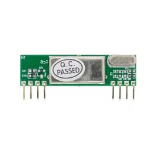
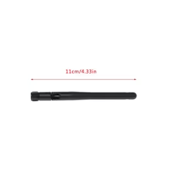
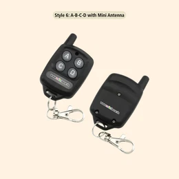
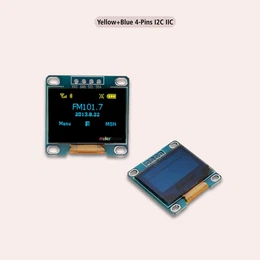
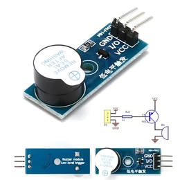
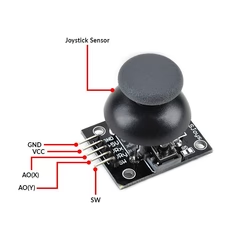
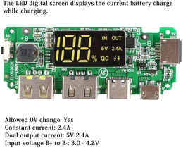
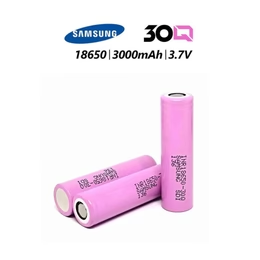

# Wireless 433MHz Quiz Buzzer System

This project is a low-latency, localized Machine-to-Machine (M2M) quiz buzzer system. It supports up to 8 wireless teams using an ESP32 microcontroller and custom Python firmware to decode analog radio signals. The system features a custom noise-filtering protocol to stabilize RF data, separate game modes (Rapid Fire and Tie-Breaker), and an onboard I2C OLED interface.


---

## Bill of Materials (Hardware)

* ESP32 Development Board

* AG-RXB6 433MHz Superheterodyne Receiver

* 433 Mhz 2.5dbi Omnidirectional Folding Antenna

* 8x EV1527 4-Button RF Remotes (Operating at 433MHz)

* 0.96 inch 128 x 64 I2C OLED Display Module

* 3V Passive Buzzer

* Analog Joystick Module

* 5V USB Power Bank Module

* 1x 18650 Li-ion Battery


---

## Hardware Architecture & Wiring

To eliminate radio frequency interference and "Ground Bounce" on the breadboard, this project utilizes a split power-rail architecture. The analog RF receiver is isolated on the 5V line with a dedicated ground, while digital peripherals run on the 3.3V line.

| Component | Pin Connection | ESP32 Pin |
| **AG-RXB6 Receiver** | VCC | VIN (5V) |
| **AG-RXB6 Receiver** | GND | GND Pin 1 (Dedicated) |
| **AG-RXB6 Receiver** | DATA | Pin 26 |
| **OLED Display** | VCC | 3V3 Rail |
| **OLED Display** | SDA | Pin 21 |
| **OLED Display** | SCL | Pin 22 |
| **Joystick** | VCC | 3V3 Rail |
| **Joystick** | VRX | Pin 34 |
| **Joystick** | VRY | Pin 35 |
| **Joystick** | SW | Pin 32 |
| **Buzzer** | VCC | 3V3 Rail |
| **Buzzer** | I/O | Pin 27 |

| Component | Pin Connection | Receiver Pin |
| **Antenna** | DATA | Receiver ANT |
| **Antenna** | GND | Receiver GND |

---

## Software & Signal Processing

The firmware is written in MicroPython. Because standard 433MHz modules are highly susceptible to background RF noise and voltage spikes, the script employs a custom signal processing loop.

The software captures raw microsecond pulses, identifies the 5000us sync pulse and bit-shifts the subsequent 24 pulses to separate the 20-bit remote ID from the 4-bit button ID.

To prevent misfires caused by hardware interference, a redundancy noise filter requires the exact same ID to be read consecutively before triggering game logic:

```python
# Snippet: Core Noise Filter Logic
if raw_id == last_raw_id:
    match_count += 1
else:
    last_raw_id = raw_id
    match_count = 1
    
if match_count == 2:
    remote_id = raw_id >> 4
    button_val = raw_id & 15
    # Trigger game logic...
```

---

## Engineering Challenges & Troubleshooting

* **Hardware Interference & Star Grounding**
  Initial prototypes experienced severe signal degradation (reading misaligned IDs). This was diagnosed as ground noise caused by the OLED and buzzer sharing the same ground rail as the RF receiver. Implementing a "Star Ground" topology (giving the RXB6 a dedicated wire back to the ESP32) stabilized the digital logic threshold.

* **EV1527 Voltage Starvation**
  The EV1527 encoder chips inside the remotes require strict 12V power to maintain their oscillator timings. Dropped voltage from continuous button holds caused transmission pulses to stretch from 900us to 4000us, breaking the decoder math. This was resolved by migrating to momentary clicks and ensuring fresh 23A 12V alkaline batteries.

* **Logic Level Safety**
  The ESP32 uses strict 3.3V logic. During diagnostic testing, care was taken to route the 5V-powered RXB6 data output safely to the ESP32 GPIO pins, avoiding over-voltage damage to the microcontroller's internal logic gates.

## How to Run the System

* Flash the ESP32 with the provided main.py and buttonconfigure.py files.

* Power the system via the 5V VIN pin using a stable power bank.

* Use the onboard joystick to navigate the OLED menu and select "Rapid Fire" or "Tie-Breaker" mode.

* Player presses are logged instantly on the display, locking out subsequent presses based on the active game mode rules.

## Acknowledgments

* **OLED Driver:** This project utilizes the standard MicroPython `ssd1306.py` library originally developed by Adafruit Industries and the MicroPython community.
