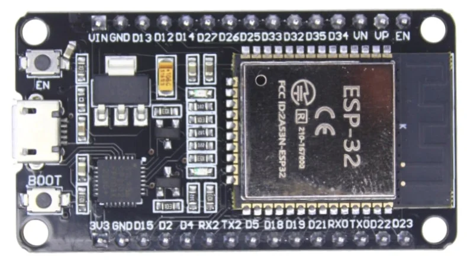

This repository is about a Wireless Quize Buzzer System
Containts

1. Hardware used
2. Software Used
3. Methods
4. Challeneges faced
5. Wiring Configurations.

6. HARDWARE USED :

   a. Esp-32 : The main processing unit
   

   b.
